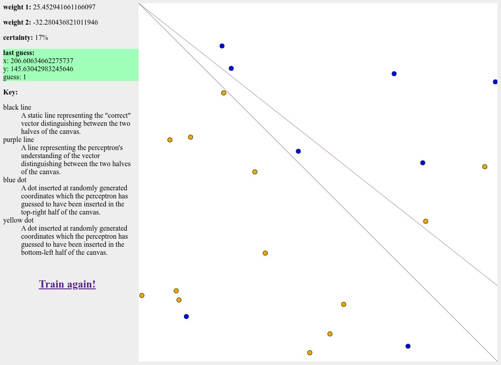

# brain

Implements an individual [perceptron](https://en.wikipedia.org/wiki/Perceptron)
and visualizes its internal understanding as it learns from training data. Very
much inspired by the extremely helpful
[video series](https://www.youtube.com/watch?v=XJ7HLz9VYz0&list=PLRqwX-V7Uu6Y7MdSCaIfsxc561QI0U0Tb)
on neural networks created by Daniel Shiffman.



## Running locally

1. Clone this repository.

```
git clone git@github.com:chasingmaxwell/brain.git
```

2. Navigate into the directory.

```
cd brain
```

3. Install dependencies.

```
yarn
```

4. Run the application.

```
yarn watch
```

5. Open a browser and navigation to `localhost:3000`. Each time you refresh the
   page a new dot will be drawn on the canvas against which the perceptron will
   be trained.
